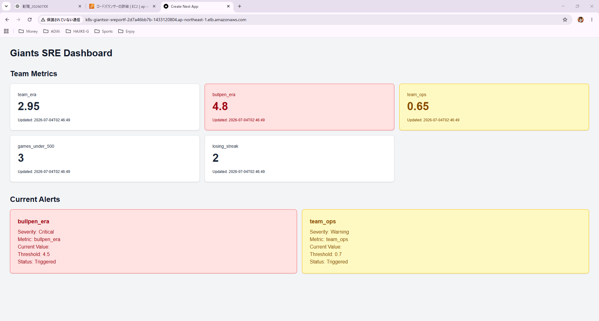

# Baseball SRE Portfolio

## Overview

This project is an SRE portfolio built on AWS.

The goal is to demonstrate:

- Kubernetes
- Terraform
- GitHub Actions
- FluxCD
- Monitoring
- Load Testing
- Incident Response

using a baseball statistics application.

## Initial Features

- Player List
- Player Detail
- Player Search
- Health Check API

## Architecture

TBD

## Frontend Dashboard

This project provides a Next.js frontend dashboard for visualizing the status of the Giants SRE monitoring system.

### Dashboard Screenshot



### Architecture

```text
Browser
↓
ALB
↓
Ingress
↓
Next.js Pod
↓
FastAPI Pod
↓
Amazon RDS for MySQL

Frontend
Framework: Next.js
Runtime: Node.js
Deployment: Amazon EKS
Exposure: AWS Application Load Balancer
Container Registry: Amazon ECR
Backend APIs used by the dashboard

The frontend dashboard calls the following FastAPI endpoints:

GET /team-metrics
GET /alerts
Dashboard features
Displays team metrics as dashboard cards
Displays current alerts
Highlights Critical alerts in red
Highlights Warning alerts in yellow
Fetches data from FastAPI through the ALB
Kubernetes resources
Deployment: giants-frontend
Service: giants-frontend-service
Namespace: giants-sre
Ingress: sre-portfolio-ingress
Verification

The dashboard was verified through the ALB URL.

Verified items:

The Next.js dashboard is displayed through the ALB
Team metrics are displayed correctly
Current alerts are displayed correctly
Critical alerts are highlighted in red
Warning alerts are highlighted in yellow
The frontend can communicate with the FastAPI backend